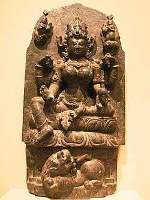

- 池梦彪 #人物 #传说
	- 陈留人，是唐朝的开国名将，也是常见于台湾庙宇所供奉的“池府千岁”，相传与下列将领李大亮、吴孝宽、朱叔裕、范承业为结拜兄弟，有关池梦彪的传说也很多，但是真的逝世日期却无法确定。
	- 贞观17年（公元643年），随唐太宗李世民御驾亲征亲征高句丽，势如破竹，又加封为宣威将军。
	  传说池梦彪某夜梦见一位瘟神，奉玉皇大帝旨令下凡降灾、散布瘟疫，池梦彪得知此事之后，便请这位瘟神到家中饮酒畅谈。
	  池梦彪与瘟神畅饮之后，瘟神有点喝醉了，就吐露出此次下凡之意，池梦彪心肠慈悲，不忍百姓受灾，假意说要借看布瘟用的药粉，趁瘟神不注意时将那包瘟药全部吞掉。
	  带原瘟疫的毒药进入池梦彪腹中，药性发作，随即满脸变黑，两眼突出而亡。
	  瘟神带着池梦彪的魂魄晋见玉皇大帝，玉皇大帝感念他爱民救民的精神，敕封池梦彪为代天巡狩，六月十八日为圣诞千秋。
- 帕爾瓦蒂 #神话
	- 雪山神女（梵语：पार्वती Pārvatī，字面意思是山的女儿；音為帕爾瓦蒂，又古名：umapati；音為烏摩缽底），又稱為烏摩天妃或大自在天妃，印度教女神，恆河女神的姐姐。主神濕婆的妻子。
	- 雪山神女为雪山神（喜马拉雅山的人格化）的女儿，妹妹是恆河女神。按某些《往世书》的说法，她的前世是湿婆的第一个妻子娑提。娑提是生主之一的达刹的女儿，因其父反对其与湿婆结合而投火自焚（印度寡妇殉葬的习俗娑提即由此得名）。另一位大神毗湿奴為了勸阻悲傷的湿婆，将娑提的尸体切碎投向世界各地，后来转生为雪山神女。《梵转往世书》说娑提曾亲自对湿婆显灵，告知湿婆她将以雪山神的女儿之形态复活。
	- 雪山神女转世后仍然热恋湿婆，并为了引起湿婆的注意而迁居到其修行地吉罗娑山（即冈仁波齐峰）上。但湿婆一心修行，对她不理不睬。其实这一结合还有更重要的实际目的，那就是希望湿婆能生出铲除阿修罗的孩子，以消灭强大的阿修罗王多罗伽。多罗伽虔敬地崇拜梵天，因此被梵天授予了无敌的力量（按湿婆往世书，梵天赐福给多罗伽，並預言他只能被湿婆的儿子打败，而湿婆并没有儿子）。甚至连大神毗湿奴都拿他没办法，毗湿奴曾与多罗伽大战了两万年，也无法将之消灭。众神只好希望雪山神女能为湿婆生一个儿子，于是派爱神伽摩去撮合他们。结果湿婆因修行被打扰而发怒，从额头上的第三只眼中喷出神火把爱神烧成了灰。后来经爱神的妻子哀求，湿婆才将爱神复活，但是愛神從此變成無形無相。
	- 爱神的行动失败后，为感动湿婆，雪山神女立志进行艰苦的修行。湿婆得知此事之後，就变成一个婆罗门前去试探雪山神女，在她面前拼命诋毁自己的本尊。但雪山神女全部驳斥了这些谎言。湿婆终于被打动了，于是与雪山神女结婚，不久生下了战神室建陀（即鸠摩罗，后来被与泰米尔人的神祇牟楼干混同）和羣主（象头神）。室建陀率领天兵天将消灭了多罗伽。羣主则因在出生喜宴时忘了邀请土星神娑尼，而被后者烧掉了头颅。梵天许诺说，雪山神女在林中看到的第一个动物的脑袋将长到她儿子脖子上。雪山神女看到了大象，于是儿子就长了一个象头。其它说法则认为切掉儿子头颅的是湿婆，羣主為了守護母親的浴室，擋住了回家的湿婆，湿婆一怒之下就斬首了對方，才發覺對方原來是自己的孩子，后来湿婆又为了不让雪山神女伤心，而去問毘濕奴讓愛子復活的方法。毗濕奴說，只要在樹林中看到第一個動物的頭顱，就將之梟首，回家安裝在羣主身上就行了，所以湿婆殺了一隻大象，让儿子长出了一个象头。
	- 由于雪山神女象征着湿婆的黑色“性力”，因此雪山神女原本是拥有乌黑的肌肤。有一次湿婆抱着雪山神女时，湿婆打趣地说她的皮肤太黑，当她躺在他雪白的身上时，仿佛一条黑蛇爬上一棵檀香树。听到湿婆这样说她，自尊心很强的雪山神女非常生气，独自离开了喜马拉雅山，专心过起了苦行生活。最终她苦修成功，梵天赐予了她一身金色的肌肤。于是她身上脱落下来的黑色化为了迦梨女神（时母）。
	- 