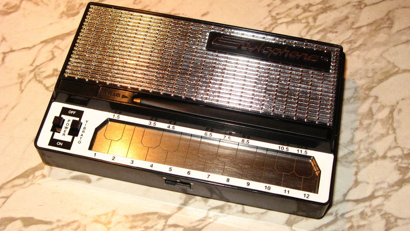
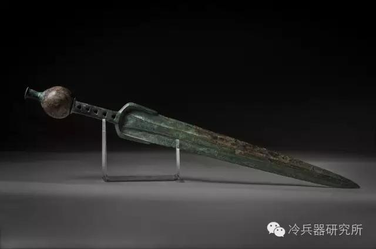

- 小异邦人 #书
	- 连城三纪彦
	- 从学生时代开始就对电影和演剧感兴趣，曾为了钻研剧本而去巴黎留学。1978年，还在大学求学期间便写出处女作《变调二人羽织》，不仅获得第三届“幻影城新人奖”并正式出道，也奠定了其将推理小说中的诡计设计与爱情小说的细腻精巧近乎完美结合的双栖风格，并于后来创作出一系列知名代表作。
	- 1981年，《一朵桔梗花》获得“日本推理作家协会奖”；1984年，《宵待草夜情》获得“吉川英治文学新人奖”，同年以《情书》获得第91届“直木奖”；1996年，《隐菊》获得“柴田炼三郎奖”。这些作品大多以日本大正末期至昭和初期的社会风情为背景,将那个时代下孤独的日本社会和危险的男女关系刻画得栩栩如生，形成一幅幅浪漫绮丽的悲剧故事，充满日式美学特有的物哀气质。
	- 2009年，连城三纪彦被查出罹患胃癌，同年出版生涯最后一篇短篇小说《小异邦人》，再次惊艳日本文坛。随后，连城一直与病魔作斗争，直至2013年10月病逝，享年65岁。
- 一朵桔梗花 #书
	- 连城三纪彦
- stylophone #乐器
	- Stylophone是风靡于上个世纪七十年代的玩具电子乐器，是一位发烧友在为其孩子修理玩具电子琴时突发奇想,他不但将电子琴复原,还添加了一系列音色修饰功能,创造出一个音质奇佳音色优美的新型掌上电子乐器,获得专利后经美国BBC TV宣传,这款掌上乐器获得了很高的声誉,被称为二十世纪最伟大的小乐器.这个神奇的小乐器就是Stylophone 这款小乐器不只是音乐发烧友的玩伴，同时也受到著名的滚石乐队的青睐，曾经在演唱会上大玩Stylophone，制造出超炫完美旋律。另类摇滚先驱David Bowie在其A RealityTour In Hong Kong音乐会上，展示了一部在六十年代末购自香港的小型Stylophone琴，还即场以它伴奏即兴唱了两句歌曲Space Oddity。
	- https://digilog.tw/posts/801
	- 
- 汽车lsd  限滑差速器 #汽车
	- 限滑差速器（英文：Limited Slip Differential，縮寫：LSD）是車用差速器的一種高級分類。普通差速器（或可稱為開放式差速器）在在一侧車輪打滑或者離地的情況下，会把所有的驱动力传送至空转轮，車輛不但無法前行，大量的動力也會消耗掉，而限滑差速器則能避免這種情况。
	- 
- 司康 #食品
	- 司康（英语：scone）又称为英式华夫饼、葡萄小圆饼，简称司康，是一种面团状、维持半生面糊状态的松软小麦制品，介于面包和蛋糕的口感之间的食物，质地蓬松、口感结实。司康被认为是英国下午茶文化最具代表性的甜点，经常融合了葡萄干或栗子出现在英国下午茶盘的第二层。
	- 而司康的名称由来相传与苏格兰历代国王的加冕有关，苏格兰国王在进行加冕仪式时，都会坐在一块名为 Stone of Scone的石头之上，而由于司康这种烤饼跟这块石头的造型很像，因而得名。
	- 
	- 
- 胡椒 #食品
	- 上等的奢侈品
	- 《新唐书》记载，在唐代宗时期，曾将一位宰相抄家，宰相家里的金银珠宝那是不计其数。然而唐代宗并没有生气，但是随后，从宰相家里抄出了64吨胡椒。皇帝知道后勃然大怒，下令将宰相满门抄斩。
	- https://new.qq.com/omn/20210205/20210205A01TJO00.html
	- “奴这床后茶叶箱里，还藏着四十斤沉香、二百斤白蜡、两罐子水银、八十斤胡椒，你明日都搬出来，替我卖了银子。”——《金瓶梅》第十六回
	- http://www.qulishi.com/article/201907/348645.html
- 固态电池 #科技
	- 固态电池是一种电池科技。与现今普遍使用的锂离子电池和锂离子聚合物电池不同的是，固态电池是一种使用固体电极和固体电解质的电池。
	- 由于科学界认为锂离子电池已经到达极限，固态电池和石墨烯电池于近年被视为可以继承锂离子电池地位的电池。固态锂电池技术采用锂、钠制成的玻璃化合物为传导物质，取代以往锂电池的电解液，大大提升锂电池的能量密度。
- 窃符救赵 #历史
	- 窃符救赵，是战国时期著名历史典故。故事概况为：魏安釐王二十年（公元前257年），秦国围困赵国都城邯郸，赵国求救于魏国，魏国惧怕秦国，不敢出兵救赵。情急之下，信陵君魏无忌听取侯赢之计，以国家利益为重，置生死度外，借魏王姬妾如姬之手窃得兵符，夺取了魏国兵权，不仅成功击败秦军、救援了赵国，也巩固了魏国在当时的地位。信陵君以国家利益为重、个人生死荣辱为轻的优良品德自古以来，饱受称颂。
- 马特洪峰 #登山
- 马特洪峰（英语、德语Matterhorn，意大利语Monte Cervino，法语Mont Cervin）别称马特宏峰  ，是阿尔卑斯山脉最为人所知的山峰。
  马特洪峰的位置在瑞士与意大利之间的边境，接近瑞士小镇采尔马特(Zermatt)和意大利小镇Breuil-Cervinia。
  马特洪峰是阿尔卑斯山脉中最后一个被征服的主要山峰。原因不只在于攀登技术上的种种困难，也在于此峰陡峭的外形给予早年攀山者的心理恐惧。
- 轻吕 #武器 #剑
	- “轻吕”实际上是吐火罗语，一种短剑，据传牧野之战取得胜利后，武王用“轻吕”击刺纣王的尸体。亦名“径路刀”。
	  
- 斯坦尼斯拉夫·莱姆 #人物
	- 斯坦尼斯拉夫·莱姆（波兰语：Stanisław Herman Lem，1921年9月12日－2006年3月27日），波兰科幻小说作家。
	- 他的作品常探讨哲学主题：科技的影响、智慧的本质、与外星人互相理解的可能性、人类能力限制。他的许多科幻小说都具有讽刺和幽默的特点。
	- <
	- 《星际旅行日记》
	- 《太空旅行者的回忆录》