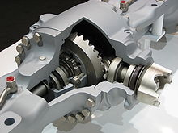
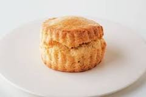

- 小异邦人 #书
	- 连城三纪彦
	- 从学生时代开始就对电影和演剧感兴趣，曾为了钻研剧本而去巴黎留学。1978年，还在大学求学期间便写出处女作《变调二人羽织》，不仅获得第三届“幻影城新人奖”并正式出道，也奠定了其将推理小说中的诡计设计与爱情小说的细腻精巧近乎完美结合的双栖风格，并于后来创作出一系列知名代表作。
	- 1981年，《一朵桔梗花》获得“日本推理作家协会奖”；1984年，《宵待草夜情》获得“吉川英治文学新人奖”，同年以《情书》获得第91届“直木奖”；1996年，《隐菊》获得“柴田炼三郎奖”。这些作品大多以日本大正末期至昭和初期的社会风情为背景,将那个时代下孤独的日本社会和危险的男女关系刻画得栩栩如生，形成一幅幅浪漫绮丽的悲剧故事，充满日式美学特有的物哀气质。
	- 2009年，连城三纪彦被查出罹患胃癌，同年出版生涯最后一篇短篇小说《小异邦人》，再次惊艳日本文坛。随后，连城一直与病魔作斗争，直至2013年10月病逝，享年65岁。
- 一朵桔梗花 #书
	- 连城三纪彦
- stylophone #乐器
	- Stylophone是风靡于上个世纪七十年代的玩具电子乐器，是一位发烧友在为其孩子修理玩具电子琴时突发奇想,他不但将电子琴复原,还添加了一系列音色修饰功能,创造出一个音质奇佳音色优美的新型掌上电子乐器,获得专利后经美国BBC TV宣传,这款掌上乐器获得了很高的声誉,被称为二十世纪最伟大的小乐器.这个神奇的小乐器就是Stylophone 这款小乐器不只是音乐发烧友的玩伴，同时也受到著名的滚石乐队的青睐，曾经在演唱会上大玩Stylophone，制造出超炫完美旋律。另类摇滚先驱David Bowie在其A RealityTour In Hong Kong音乐会上，展示了一部在六十年代末购自香港的小型Stylophone琴，还即场以它伴奏即兴唱了两句歌曲Space Oddity。
	- https://digilog.tw/posts/801
	- 
- 汽车lsd  限滑差速器 #汽车
	- 限滑差速器（英文：Limited Slip Differential，縮寫：LSD）是車用差速器的一種高級分類。普通差速器（或可稱為開放式差速器）在在一侧車輪打滑或者離地的情況下，会把所有的驱动力传送至空转轮，車輛不但無法前行，大量的動力也會消耗掉，而限滑差速器則能避免這種情况。
	- 
- 司康 #食品
	- 司康（英语：scone）又称为英式华夫饼、葡萄小圆饼，简称司康，是一种面团状、维持半生面糊状态的松软小麦制品，介于面包和蛋糕的口感之间的食物，质地蓬松、口感结实。司康被认为是英国下午茶文化最具代表性的甜点，经常融合了葡萄干或栗子出现在英国下午茶盘的第二层。
	- 而司康的名称由来相传与苏格兰历代国王的加冕有关，苏格兰国王在进行加冕仪式时，都会坐在一块名为 Stone of Scone的石头之上，而由于司康这种烤饼跟这块石头的造型很像，因而得名。
	- 
	- 
- 胡椒 #食品
	- 上等的奢侈品
	- 《新唐书》记载，在唐代宗时期，曾将一位宰相抄家，宰相家里的金银珠宝那是不计其数。
	- 皇帝知道后勃然大怒，下令将宰相满门抄斩。
	- https://new.qq.com/omn/20210205/20210205A01TJO00.html