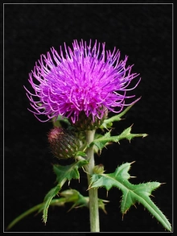
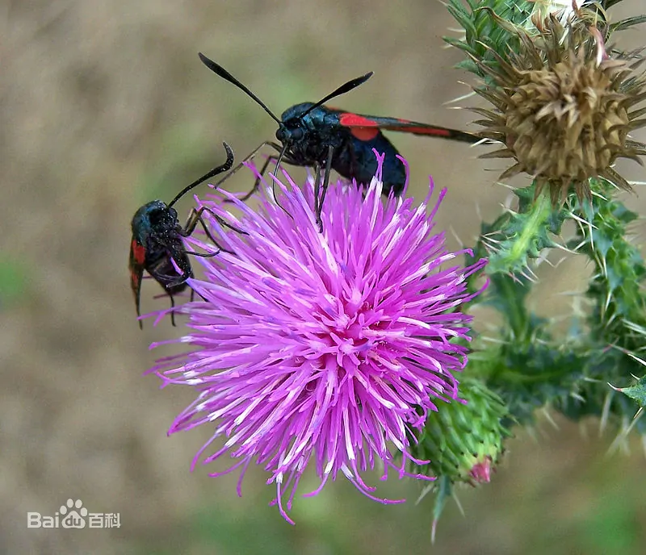

- 五朝古都北京 #历史
	- 蓟或蓟城是中国北方的一个城市，被视为现代北京地区有人持续居住历史最久的部分。最早在公元前1045年周朝建立时就在史书上提及，《史记》中记载：“（封）帝尧之后于蓟”。因为蓟花得名。
		- 蓟花，苏格兰国花。在希腊神话里，大地女神对多才多艺的克利斯心生爱慕，一心想找机会向这位能吟诗作曲的狩猎高手牧羊人诉说情意，哪知落花有意流水无情，饱尝单恋的悲痛之余，将自己化作蓟花来表示“心如针刺”之苦。 在西方，其被称为“受祝福的蓟”的花种，相传是圣母玛利亚将基督被钉在十字架上的钉子取下来后，埋在地下长出来的植物。
		-  
	- 公元前1122年，周武王灭商以后，封其弟姬奭于燕地（今北京房山琉璃河镇东北董家林古城），这便是历史上著名的燕国，北京在当时被称为燕都或燕京。
	- 北京作为国都的历史要从契丹人所建立的辽朝政权开始算起。辽朝共有五京，其中幽州（今北京）就是五京中的南京。上京临潢府（今内蒙古赤峰），东京辽阳府（今辽宁辽阳），中京大定府（今内蒙古宁城），南京析津府（今北京），西京大同府（今山西大同）
	- 金朝灭辽后，北京成为金朝的重要政治中心。1153年，金朝第四任皇帝完颜亮将国都从上京（今黑龙江省哈尔滨市阿城区城南）迁至北京，并更名为中都。
	- 《金史》记载：“都城凡七十五里，城门十二”。金中都的北城墙在现在宣武门内大街西绒线胡同、新文化街一线，西城墙在今广安门附近。
		- 丽泽门，现在的丽泽商务区
	- 元朝入主中原后将国都从哈拉和林迁至金中都，并更名为大都。由于蒙古大军在攻打金中都的过程中对其进行了非常严重的破坏，因此元世祖忽必烈决定在中都之北，即金朝大宁宫的位置重新建立皇宫和都城。
	- 明朝建立后，明太祖朱元璋将国都选在了应天府（今南京）。然而在朱元璋去世后，他的第四子、燕王朱棣起兵造反，从建文帝（朱元璋之孙）手中夺走了皇位。考虑到自己的权力根基位于北平，于是朱棣下令将国都迁至北平，也就是我们今天的北京。
- 温良恭俭让 #国学
	- 原意为温和、善良、恭敬、节俭、忍让这五种美德。
	- 《论语.学而》：子禽问于子贡曰：夫子至于是邦也，必闻其政，求之与？抑与之与？子贡曰：夫子温、良、恭、俭、让以得之。夫子之求之也，其诸异乎人之求之与！
- 大宪章 #政治 #历史
	-
-