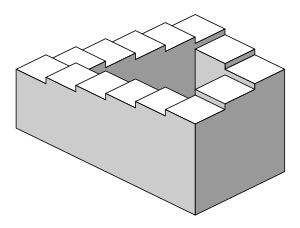

- 心理学与灵魂 #书 奥托兰克
	- 两个人通过婚姻关系彼此完善，成为更好的自己，同时又不过多的侵犯对方的个性，他认为所谓的婚姻是一个人帮助另一个人发展，成长。
- 彭罗斯阶梯 #名词
	- 
	- 彭罗斯阶梯（英语：Penrose stairs）是一个有名的几何学悖论，指的是一个始终向上或向下但却无限循环的阶梯，可以被视为彭罗斯三角形的一个变体，在此阶梯上永远无法找到最高的一点或者最低的一点。彭罗斯阶梯由英国数学家罗杰·彭罗斯（Roger Penrose）及其父亲遗传学家莱昂内尔·彭罗斯（Lionel Penrose）于1958年提出[1]。
- 卡尔萨根车库之龙 #名词
	-