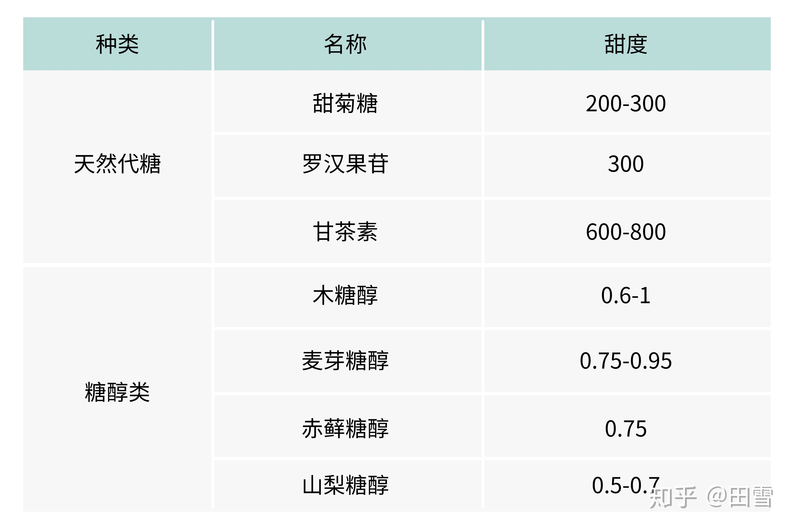
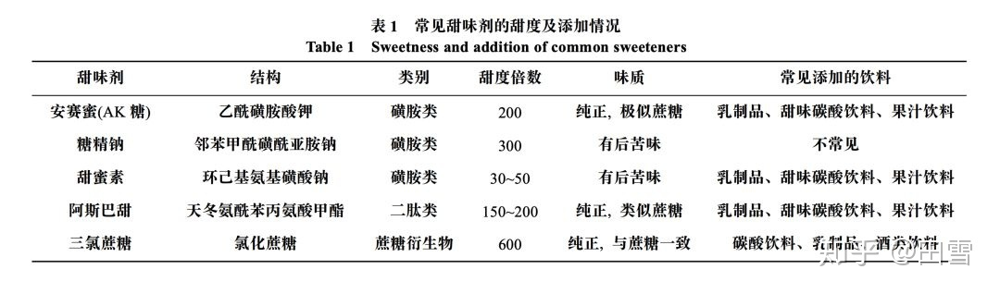

- Glasnost 开放政策  #单词
	- Glasnost (/ˈɡlæznɒst/; Russian: гласность, IPA: [ˈɡlasnəsʲtʲ] (listen)) has several general and specific meanings – a policy of maximum openness in the activities of state institutions and freedom of information, the inadmissibility of hushing up problems, and so on. It has been used in Russian to mean "openness and transparency" since at least the end of the 18th century. This word is included in the English dictionary.
- 代糖 #营养
	- 甜度小知识：
	  甜味是糖的重要性质, 甜味的强弱用甜度来表示。 通常以蔗糖作为基准物, 一般以10%或15%的蔗糖水溶液在20℃时的甜度为1.0, 其他糖的甜度则与之相比较得到。
	- 天然甜味剂
		- 甜菊糖、罗汉果苷
		- 木糖醇、山梨糖醇、麦芽糖醇、 甘露醇、赤藓糖醇等
		- 
	- 人造甜味剂
		- 阿斯巴甜、安赛蜜、糖精、三氯蔗糖（蔗糖素）等
		- 
-