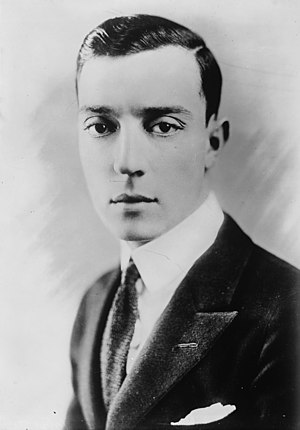

- 孙维世 #人物
	- 周恩来养女 红色公主
	- 文革期间被江青叶群等人迫害致死
- 春天的十七个瞬间 #电视剧
	- 电影讲述的是1945年春的17天里发生的事情。苏联情报人员施济利茨长期潜伏在纳粹德国，此时已经是党卫队旗队长。他的上级中央要求他调查德国高层官员中谁在和西方单独媾和。他的机智勇敢最终破坏了敌人的计划，并成功解救了自己的报务员。
- 巴斯特·基顿 #人物
	- 约瑟夫·弗兰克·“巴斯特”·基顿（英语：Buster Keaton，1895年10月4日－1966年2月1日）[2]是一名美国演员、喜剧演员，电影导演、制片人、编剧和特技演员[3]。他以其无声电影而闻名于世，同时，基顿也因为在其电影作品中标志性依然故我、不苟言笑的肢体喜剧表演风格而收获了“大石脸”（The Great Stone Face）的昵称。
	- 
- 成住坏空 #佛教
	- 成、住、坏、空指的是四劫。此系佛教对于世界生灭变化之基本观点。于佛教之宇宙观中，一个世界之成立、持续、破坏，又转变为另一世界之成立、持续、破坏，其过程可分为成、住、坏、空四时期，称为四劫。
	- 成劫
		- 有二十增减，初由初禅天至地狱界次第成立，后十九增减则由光音天次第降生，最后下生无间地狱，即有情世间之成立，是谓之成劫。
	- 住劫
		- 安住于两种世间，其间亦经二十劫。
	- 坏劫
		- 亦有二十增减，其初之十九增减由初禅天至地狱之有情，各随其业因或生于二禅以上，或移于他界，不损人，至有情世间而坏，其后一增减，发大火灾，荡尽初禅以下，谓之坏劫。
	- 空劫
		- 坏劫后，虚空无物亦有二十增减，四劫合成为八十增减，增减即住劫之数，人自十岁起，每过百年，增一岁，至八万四千岁为增劫之极；又自八万四千岁起，每过百年减一岁，至十岁为减劫之极。一增一减，共计一千六百八十万年，是名一小劫，二十增减者即二十小劫，此为一成劫之量，其他三劫的时量，皆同此。
	- 成劫
	  （梵 vivarta-kalpa），为器世间（山河、大地、草木等）与众生世间（一切有情众生）成立之时期。即由有情之业增上力，于空间生起微细之风，次第生成风轮、水轮、金轮，渐成山河、大地等器世间，其时，诸有情渐次下生，最终之时一切有情生于无间地狱
	  住劫
	  （梵 vivarta-stha^yin-kalpa），又称续成劫。为器世间与众生世间安稳、持续之时期。此一时期，世界已成，人寿由无量岁渐次递减，至人寿十岁，称为住劫中之第一中劫，此后之十八中劫亦皆一增一减，人寿从十岁增至八万四千岁，复由八万四千岁减至十岁。最后一中劫（第二十中劫）为增劫，即由十岁增至八万四千岁。又据立世阿毗昙论载，诸佛之出现，多在减劫之时，其时人寿由八万四千岁减至百岁之间
	  坏劫
	  （梵 sam!varta-kalpa），火、水、风三灾毁坏世界之时期。众生世间首先破坏，称为趣坏（梵 gati-sam!vartani^）、有情坏（梵 sattva-sam!vartani^）；其后，器世间亦随而破坏，称为界坏（梵 dha^tu-sam!vartani^）、外器坏（梵 bha^jana-sam!vartani^）。即于此劫之初，地狱之有情命终之后，不复更生，其后，其余傍生、鬼趣及人、天等之众生亦渐次坏灭；有情破坏后，世界出现七个日轮，故起火灾，色界初禅天以下皆成灰烬，次起水灾，第二禅天以下漂荡殆尽，最后起风灾，第三禅天以下全部吹落
	  空劫
	  （梵 sam!varta-stha^yin-kalpa），世界已坏灭，于欲、色二界之中，唯色界之第四禅天尚存，其他则全入于长期之空虚中。此成、住、坏、空四劫之期间，各有二十中劫，总合为八十中劫，称为一大劫。
	-
	-