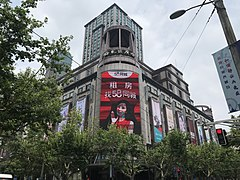

- 上海隔都 Shanghai Ghetto  #地名
	- 上海隔都（英语：Shanghai Ghetto）是在第二次世界大战期间，日本占领下的上海虹口区一块面积约为1平方英里的犹太区，那里居住着大约2万名从纳粹德国、奥地利、波兰和立陶宛逃亡来此的犹太难民。
- 沙逊家族 #人物
	- 维克多·沙逊是一名犹太商人，他和众多的犹太商人一样有着敏锐的商业头脑，在生意场上可谓是风声水起。在当时他的资产可谓是无人匹敌，他一度被称为上海首富以及中国首富，甚至远东首富，成为当时在华的犹太商人中的王者。
	- 和平饭店
	- https://weibo.com/ttarticle/p/show?id=2309404756637201334604&sudaref=www.baidu.com
- 嘉道理 #人物
	- 嘉道理家族（英语：Kadoorie；希伯来语：כדורי‎；阿拉伯语：خضوري‎），是一个富裕的米兹拉希犹太族裔家族，祖先世居伊拉克首都巴格达。18世纪时迁居至印度孟买，19世纪在中国上海跟随沙逊家族发迹。
	- 怜悯心，帮助穷人，打破上海的两层皮
	- 上海大酒店
	- 中电
- 哈同 #人物
	-
- 新金山 澳洲墨尔本 #城市
	- 旧金山是华人叫出来的美国城市，1848年，有人在那里的流水里面发现了金沙，顿时引发了全世界的淘金热，数千万的华人被贩卖过去挖矿淘金。
	- 1851年，墨尔本也发现有金矿，更多怀揣淘金梦的华人纷纷移民过去，将这个撤镇建市不久的州府叫做“新金山”。
- 大华饭店 #景点
	- https://zh.m.wikipedia.org/zh-hans/%E5%A4%A7%E8%8F%AF%E9%A3%AF%E5%BA%97
	- 
	- 现地点梅龙镇广场
- 龙樱 #漫画
	- 龙樱（ドラゴン桜）是一部已经完结的日本漫画，全21卷。作者为三田纪房，从2003年开始在讲谈社的漫画周刊《周刊Morning》连载。原作的漫画详细介绍了各种考试与念书技巧，与和田秀树所著的《考试就是靠诀窍》，福田一成的《一次逆转○密技读书法》一起在考试界造成话题。每隔一集也会介绍面临考试应有的心态。此外，与教养孩子有关的内容也相当多，让作品描述的领域更加宽广。作品中的樱木老师让学生直接体验现实世界的严
-