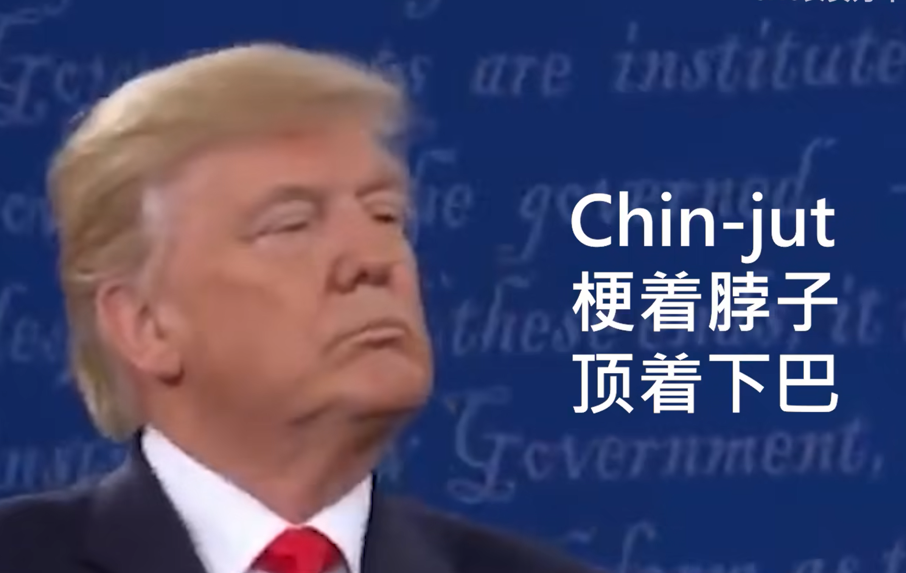
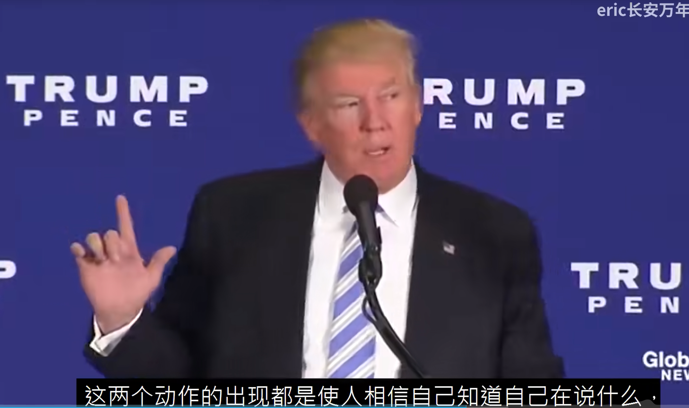
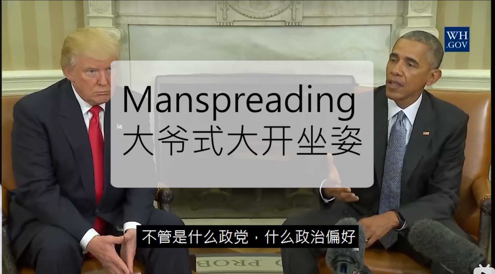

- trump的语言结构
	 - 1.用词简单，小学生词汇

	 - 2.重复，反复

	 - 3强调的东西反复在结尾

	 - 4.售卖焦虑，不买才是你的问题

	 - 他是一个alpha male 是狼群里面的头狼

	 - 他是一个business man 圆滑的另外一面

	 - chin-jut 

	 - precision 兰花指

	 - 

	 - 

	 - steppled fingers 指尖相顶

	 - 

	 - 注重内容？还是注重表达？

	 - 

	 - 
