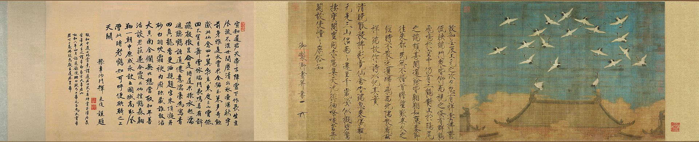
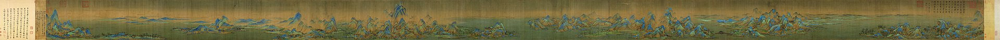
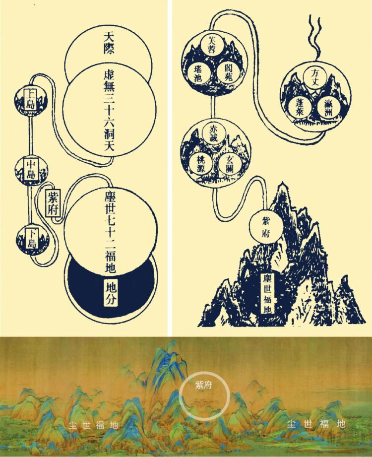
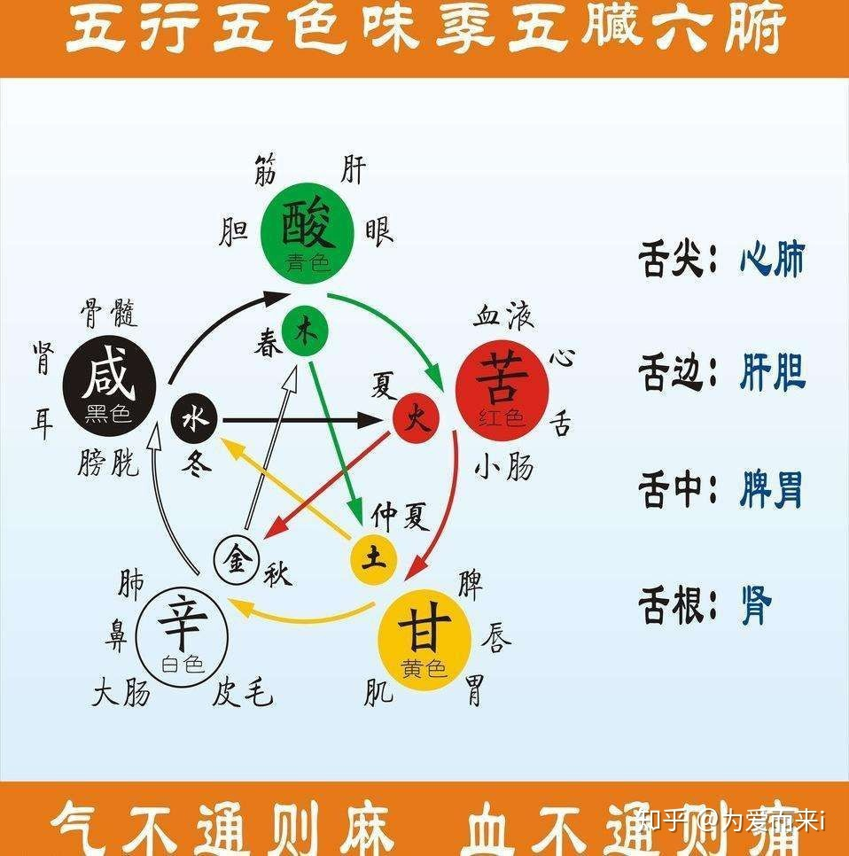

public:: true

- 三元节 #宗教 #道教
	- 道教有天、地、水三官大帝载录世人善恶之说，三元节，就是“三官大帝”的诞辰，并以天官生日为上元节，为天官赐福之日，要举行祈福法事；地官生日为中元节，为地官赦罪之日，要普渡孤魂；水官生日为下元节，为水官解厄之日，请神明为运势不好的人消灾解难。
	- 瑞鹤图，正好在上元节释放仙鹤，来应对仙人下凡视察
	- 
- 千里江山图 #艺术
	- 希孟作品，宋徽宗一系列用来推进道教的手段之一
	- https://www.xiaoyuzhoufm.com/episode/62e6a7295e0ce637ff09f187
	- 
	- 《千里江山图》整体描绘的其实是道教仙境：蓬莱三岛十洲
	- 对比萧道冉《海中三岛十洲之图》描绘的蓬莱仙境模型，我们可以发现道教传说中的“紫府”和“尘世福地”分别可以对应到《千里江山图》中的宫阙建筑群和普通建筑群。《千里江山图》中群山严格按照“山立宾主”的原则，主峰与群山构成了“君臣上下”关系。只有在最高峰下出现了规制最高的宫阙建筑群。谈老师认为这正是对仙人居所“紫府”的描绘。
	- 
	- 在全图的次高峰正下方，出现了三层台式建筑，即是道教中常见的坛，具有 “醮天“、“迎仙”、“镇妖”、“祈雨”、“祈晴”等功能。坛旁还有两只仙鹤，是道教的重要祥瑞。
	- 
	-
- 青绿 #艺术 #颜色
	- 青绿是石青和石绿的简称。石青是蓝铜矿，石绿是孔雀石，都是铜矿的伴生品。在新疆克孜尔石窟和敦煌石窟，也存在一些青绿来自产于阿富汗的青金石，由于含有金色的颗粒而被称作“金碧”“。
	- 但是后人拿金勾边，曲解了含义
	- 按照中国先秦的“五色”制度和节令概念，青对应了“东方”和“春天”。道教的基本理论是“春生秋杀”：春是生长季节，万木复苏；秋是肃杀的季节，万木开始凋零。而修道的目的就是求长生。因此青绿也成为了道教“春生“这一概念的色彩体现。
	- 五行、五氣、五臟、五味、五色
		- 五色《即青（绿）东方青龙、赤南方朱雀、黄中间、白西方白虎、黑北方玄武》
		- 五色《即青（绿）、赤、黄、白、黑》
		- 
		-
	- 宋代以前的青绿画都和道教有关；元代以来，出现了一些不懂道教理论，错误使用青绿的画作；而进入明代，青绿山水画就逐渐成为了一种绘画门类，道教的意味就很淡薄了。
- 道教秘图 #宗教 #道教
	- 李思聪的道士，向宋仁宗进献了道教秘图
	- 《玉虚璇极图》，述虚无旋象之神化；《洞天五岳图》，赞五岳仙山之灵境；《蓬壶阆苑图》，颂蓬岛十洲之胜概；《大溟灵渎图》，序龙宫海渎之奥妙；《名山福地图》，吟紫府丹台之秘景；《金液还丹图》，集神仙之火候。
- “洞天福地”理论 #宗教 #道教
	- 洞者通也。所谓“洞天”，乃是道教语汇，指地上的仙山，即神仙居住的名山胜地。
- 宋徽宗与道教 #宗教 #道教 #历史
	- 徽宗在即位之初就炮制了“吉人君子”的谶语，给王权制造神话色彩。
	- 徽宗自称梦见太上老君给他“兴道教”的神谕。接着便安排蔡京营建玉清和阳宫。
	- 政和二年上元节次日傍晚，徽宗人造了瑞鹤翔集的祥瑞，既肯定自己登基十二年以来的治理成果；也暗示自己就是道教传说中“受天明命”，”光降于兆人”的圣君，为未来自封道教神君埋下了伏笔。
	- 政和三年，徽宗安排希孟开始作《千里江山图》，徽宗在冬祀祭典的路上，和蔡京的儿子表演了一出见天神降临的戏码，然后亲自写下《天真降临示现记》诏告天下。
	- 政和六年，徽宗在道士林灵素的建议下，自称叫做神霄玉清王，为上帝的长子，主南方，号长生大帝君。同时给身边的道士、群臣、妃子都册封了道教仙官的名号。
	- 最后在政和七年，徽宗把玉清和阳宫改名玉清神霄宫，成为他政教合一的治理场所，标志着人神计划的阶段性实现。
- 竹笋 #事物
	- 道教的竹筍，箨 tuò龙
	- 春天龙苏醒喘息，象征生命力
	-
- 偶像失格 #书
	- 要看
	- 芥川奖获得着，主要描写日本追星一族面对偶像塌方的故事
- 好萊塢劇本標準格式 #书
	- 好莱坞剧本模式
- 经典人物原型45种 #书
	- 维多利亚•林恩•施密特，著有《高级写作技巧》、《一个月完成一本书》、《故事结构设计师》等。国际公认的创作者们关于原型方面的导师。毕业于UCLA的电影项目，获Loyola Marymount大学写作硕士学位。心理学博士。她在写作之余任教于多所大学。
	- 书中有大量选自文学作品、影视剧的例子，它们证明了这些原型多么有效和令人难忘
	- https://zhuanlan.zhihu.com/p/393012113
- 诡秘之主 #网络小说
	- 《诡秘之主》是阅文集团白金作家爱潜水的乌贼所著的西方玄幻类小说，融汇了克苏鲁风格、西方魔幻元素、第一次工业革命时代风情和蒸汽朋克情怀。这是一个蒸汽与机械的世界，这是一段“愚者”的传说。
- 规模 #书
	- https://m.douban.com/book/subject/30244461/
	- 规模不同，处理事物的方式方法不同
- 创新公司 #书
	- 要看
	- https://book.douban.com/subject/26314955/
	- 皮克斯的公司史
	-
	-