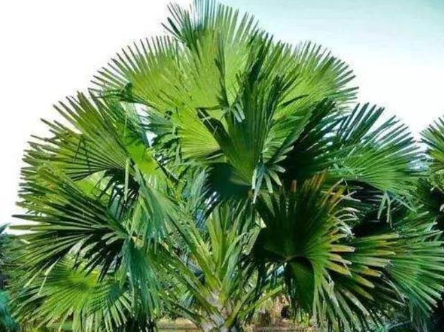

- 我用什么才能留住你 #诗歌
	- 豪尔赫·路易斯·博尔赫斯
	- 我用什么才能留住你
	  我用什么才能留住你
	  我给你萧索的街道、绝望的落日、荒郊的月亮。
	  我给你一个久久地望着孤月的人的悲哀。
	  我给你我已死去的祖辈，后人们用大理石祭奠的先魂
	  我父亲的父亲，阵亡于布宜诺斯艾利斯的边境，两颗子弹射穿了他的胸膛，死的时候蓄着胡子，尸体被士兵们用牛皮裹起；
	  我母亲的祖父——那年才二十四岁——在秘鲁率领三百人冲锋，如今都成了消失的马背上的亡魂。
	  我给你我的书中所能蕴含的一切悟力，以及我生活中所能有的男子气概和幽默。
	  我给你一个从未有过信仰的人的忠诚。
	  我给你我设法保全的我自己的核心——不营字造句，不和梦交易，不被时间、欢乐和逆境触动的核心。
	  我给你早在你出生前多年的一个傍晚看到的一朵黄玫瑰的记忆。
	  我给你关于你生命的诠释，关于你自己的理论，你的真实而惊人的存在。
	  我给你我的寂寞、我的黑暗、我心的饥渴；我试图用困惑、危险、失败来打动你。
- #名人名言 #不一定
	- 送一个人她喜欢的东西，是为了讨好她；送一个人自己喜欢的东西，又是为了什么？是为了和对方分享，还是希望对方了解自己？送出去的，是自己身体的一部分。
	- 是为了和对方分享，还是希望对方了解自己？送出去的，是自己身体的一部分。 ——罗贝托·波拉尼奥《2666》.
	- 
- 五树六花 #宗教
	- “五树六花”即佛经中规定寺院里必须种植的五种树，六种花。五树是指菩提树、高榕、贝叶棕、槟榔和糖棕；六花是指荷花（莲花）、文殊兰、黄姜花、鸡蛋花、缅桂花和地涌金莲。
	- 菩提树
	- 这个大家都理解，因为佛祖释迦牟尼在菩提树下参禅得道，并且将菩提树与佛骨舍利、佛像定为世间应受礼拜的三种器物。被佛教徒称为“圣树”的菩提树，当然应该在五树之列。
	- 
	- 高榕
	- 高榕之所以被入选五树，主要有两个原因。其一是因为高榕可以长得非常巨大，绿荫成冠，非常适合在树下讲经，有具体的实用价值；其二是因为高榕与菩提同科，由此也被佛教徒视作神圣的佛教树木。
	- 
	- 贝叶棕
	- 贝叶棕在佛教发展的初期有着巨大的、无可比拟的作用，因为它的树叶经过处理之后，可以用来书写经文，在相当长的一段时间里，佛教也被叫做“贝叶经”。
	- 
	- 槟榔
	- 在古代，因为医疗条件有限，槟榔可以入药、驱虫的特性，使得它成为很多祭祀典礼上的常客，由此也渐渐地赋予了某种神性。
	- 
	- 糖棕
	- 糖棕成为五树之一，可能跟东南亚的生活习性有关。它的叶片虽然不能向贝叶棕一样用来写经文，但是可以用来做席子；而它的果实也可以用来制糖、酿酒和制醋，因为人们广泛将糖棕应用在生活的方方面面，自然而然的也就进入了寺院的栽种范围。
	-