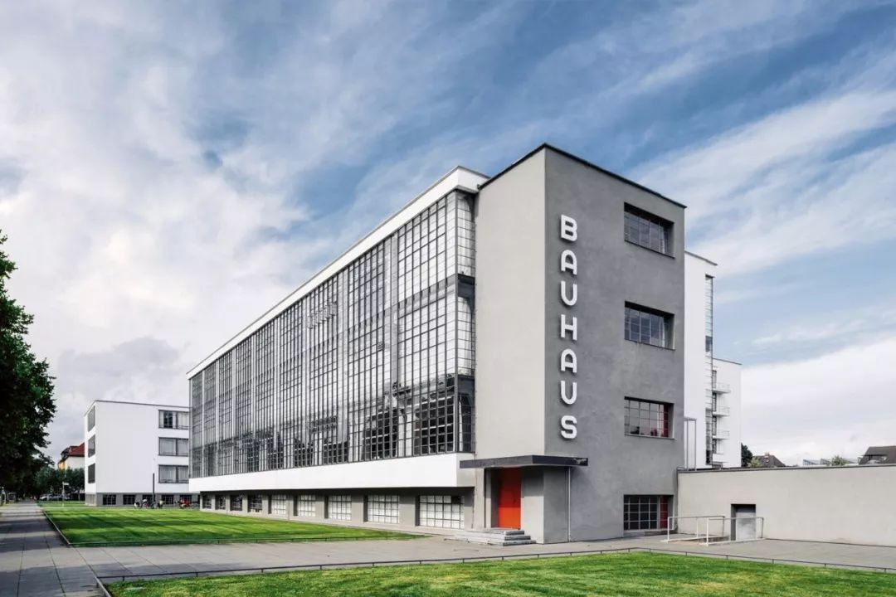

- 女真的汉化 #历史
	- 从部落推举制到世袭嫡传
	- 所以遵循汉族儒学文化
- 公园的建设 #历史
	- 主要是金为狩猎民族，转为农耕时候，希望通过建设公园，回归到打猎
	- 钓鱼台
	- 陶然亭公园
- 三宅一生 #品牌
	- https://www.huxiu.com/article/632370.html
- 野狐岭战役 #历史 #战争
	- https://zh.wikipedia.org/wiki/%E9%87%8E%E7%8B%90%E5%B6%BA%E6%88%B0%E5%BD%B9
	- 野狐岭战役是蒙金战争初期起关键作用，决定“蒙起金衰”的会战。
	- 野狐岭战役也是世界军事史上以少胜多（金兵50余万，蒙军10万）典范作战。
- 包豪斯 #艺术
	- 包豪斯本来就是两个个德语词，Bauhaus，bau=bauen建筑，建造；Haus房屋。
	- 如果仅仅把“包豪斯”理解成一个德语单词，一所设计院校，未免太狭隘了。当下我们所说的“包豪斯”，多数情况下指的是一种设计思潮、设计体系，或称之为“包豪斯主义”。
	- 其设计理论，可以归结为三点：
		- · 艺术与技术的新统一
		- · 设计的目的是人而不是产品
		- · 设计需遵循自然法则进行
	- 保罗·克里《红气球》
	- 这幅插图充分体现了克里对包豪斯著名的几何构图的异想天开的联想运用。
	- 
	- 瓦西里·康定斯基《黄·红·蓝》
	- 1923年，为了在特定的形状和颜色之间建立一种潜在的定性关系，他设计了一份问卷，要求参与者在三角形、正方形和圆形中填写最合适的原色。结果是黄色的三角形、红色的正方形和蓝色的圆形成为了包豪斯最经典的主题，康定斯基也在这部著名的作品中对其进行了探索和颠覆。
	- 
	- 瓦西里椅
	- 他设计的“瓦西里椅”（Wassily Chair）成为世界上第一把钢管皮革椅。而包豪斯设计学院作为欧洲现代主义设计的中心，更是将现代设计推到了一个空前的高度。
	- 
	- 通用字体
	- 1900年生于奥地利。他设计的通用字体是国际印刷排版的经典字体，采用了包豪斯风格的无衬线字体的最小几何设计。
	- 当时德国流行的字体繁琐，要求所有名词的第一个字母必须用大写，这令德国的字体设计大大落后于国际水平。拜耶认为字体设计的装饰线是多余的累赘，风格倾向于非常简洁的字体。他创造了无饰线体、小写字母为中心的新字体系列，成为包豪斯字体的一个特征。
	- 
	- 包豪斯校舍
	- 这座标志性的建筑有着矩形的玻璃幕墙以及从一侧延伸出来的独特的垂直标志，概括了包豪斯建筑的精神，并预测了未来几年的许多发展。
	- 这栋建筑的创新之处在于它在观众和整个建筑空间之间建立了新的关系：三个翼，根据它们的功能分开，不对称地连接在一起，没有中心视图，因此只能通过旋转来体验建筑。
	- 与此同时，在嵌入式梁上使用玻璃墙，不仅创造了充满阳光的室内空间，还允许从外部看到建筑的内部功能，暗示了一种开放和透明的精神。
	- 
	-
	- 
	- 莫霍利-纳吉的摄影作品
	- 
	- 莫霍利-纳吉把物体放在感光纸上，暴露在周围的光线下，用艺术家自己的话来说，使光成为“可塑表达的媒介”。在这张没有相机的“黑影照片”中，莫霍利-纳吉的摄影作品被认为是包豪斯技术创新精神的丰碑。
	- 安妮·阿尔伯斯的壁挂作品
	- 这件引人注目的双股壁挂运用了白色、灰色、黑色和棕色的线条、矩形和正方形，创造了一种动态的空间运动感。
	- 安妮·阿尔伯斯(Anni Albers)通过改变传统手工艺的基本功能原理，让它们具有现代创新的感觉。
	- 
	- 巴塞罗那国际博览会德国馆
	- 密斯·凡德罗作品
	- 
	- 密斯的代表作巴塞罗那椅子于1929年设计，每一个现代风格的室内设计中没一张这种椅子都不好意思拿出手。
	- 
	-