- 七夕 #风俗 #节日
	- 七夕叫做乞巧节、女儿节，乞巧的习俗最早始于西汉宫廷，宫女们用彩线穿针乞巧，宫女是不提倡自由恋爱的，所以七夕节最早的内涵主要是乞求女子巧慧，是未婚姑娘的专属节日。
	- 织女是天女，主司瓜果、丝帛和珍宝。乞巧节的食俗主要是摆设“巧果筵”，包括花糕、花点、花瓜、花果。还要盛陈美酒、菜肴于庭中，这些用来祭祀织女，礼毕就可以自己吃和送人。新鲜水果都是当季时新的，干果有五子：桂圆、红枣、榛子、花生和瓜子。
	- 花糕和花点也就是巧果（乞巧果子），这是流传最广的七夕食物，有白面和米面的，有炉烤和油炸的，有圆饼和梭形（织女的织布梭）的，花样有飞禽走兽和奇花异草的，各地风俗不一。
	- 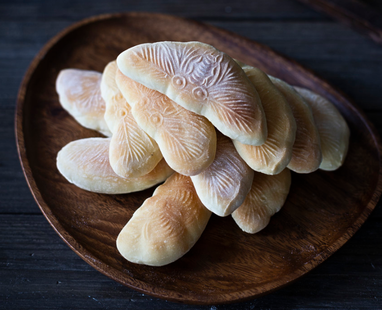
	- 雕花瓜
	- 把金瓜、葫芦、水果雕成奇花异鸟，或者在瓜皮表面上浮雕图案。手巧的姑娘就可以趁此机会大展身手。
	- 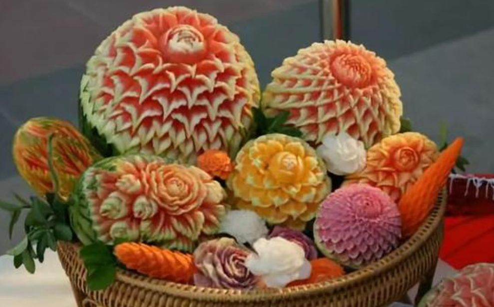
	- 巧食、巧巧饭、巧饼
	- 古代民间祭拜完织女，用饺子、馄饨、面条和油果子等做节日食物，统称为巧食
	- 巧饼
	- 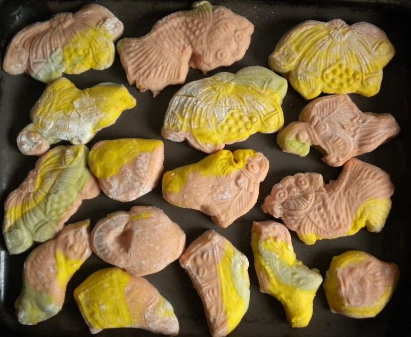
	- 巧人、巧酥
	- 在不少民间的糕点铺，师傅做一些织女形象的酥饼，俗称为巧人、巧酥，卖的时候叫“送巧人”。
	- 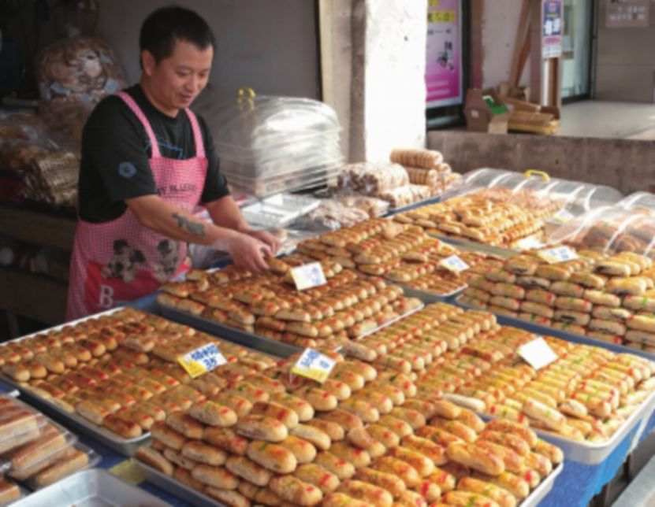
	- 汤饼
	- 《风土纪》中载：“七月黍熟，七日为阳数，故以糜为珍。今北人唯设汤饼，无复有糜。”西晋以前，七夕的食物是糜粥，西晋以后变成了汤饼。
	- 油饭
	- 福建厦门地区，除了用鲜花和瓜果祭拜之外，还做油饭和“七娘妈亭”来祭织女，因为当地人认为她是婴儿的保护神。祭礼完毕，把“七娘妈亭”焚化，吃油饭可得织女神保佑。闽南还有习俗要在七夕这一天吃石榴，煮蛋、肉和红糖糯米饭，来驱虫防瘟疫。
	- 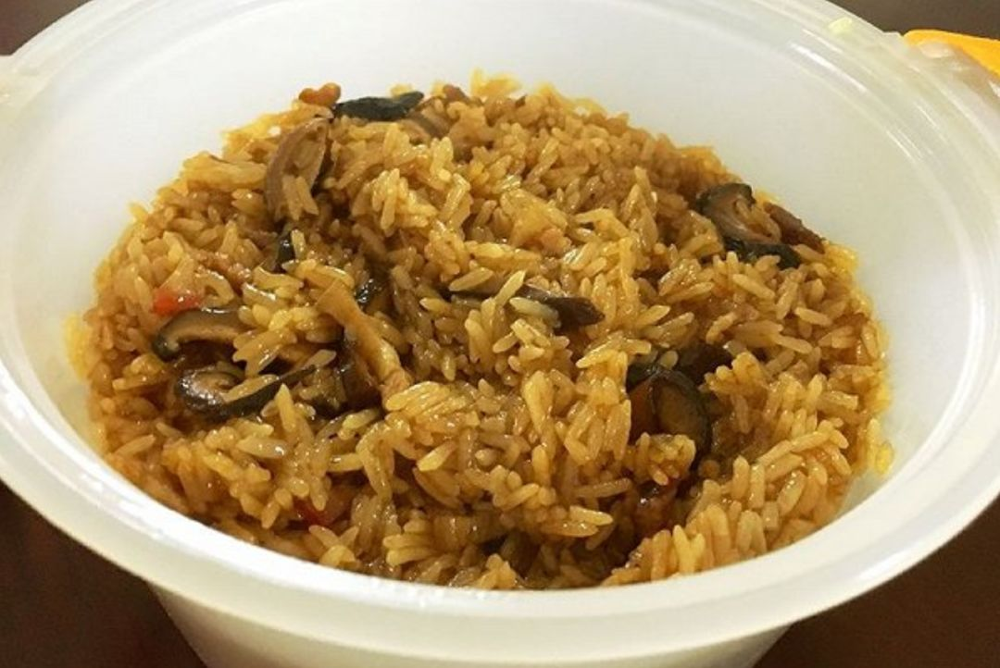
	- 杀鸡
	- 浙江金华一带，家家户户在七夕这一天杀鸡，希望没有公鸡报晓，牛郎和织女就永远不分离。
	  咬巧
	- 湖北鄂州武汉一带，吃各种土产小吃，特别是菱角，称为咬巧，还会吃花生和枣子。
- 蓝山咖啡 #咖啡 #饮料
	- 蓝山咖啡是加勒比岛国牙买加最有名的特产之一。
	- 牙买加的咖啡产量在全球排名 40 名之后，供应的咖啡仅占全球的 0.1% ～ 0.2%
	- 1960 年代，牙买加咖啡产业受飓风袭击，一度一蹶不振。是二战后经济腾飞、消费力暴增的日本以白衣骑士之姿，拯救了牙买加的咖啡产业。
	- 以 UCC（上岛咖啡，非大陆上岛咖啡）为代表的日本公司对牙买加咖啡产业进行了大笔投资，还引入了生态种植法进一步提升和保证咖啡品质。牙买加政府投桃报李，与日本签订了长达 30 年的合约，将蓝山咖啡超过 80% 的配额供给日本，欧美国家则瓜分了剩余配额，高峰时，超过 90% 的蓝山咖啡都被日本消费。在日本的狂热助推下，本就品质上佳、声名在外的蓝山咖啡获得了巨大的名声，成为全世界精品咖啡爱好者趋之若鹜的顶流。而这样的狂热也以不同的形态蔓延到了中国。
- 希腊神话 #神话
	- 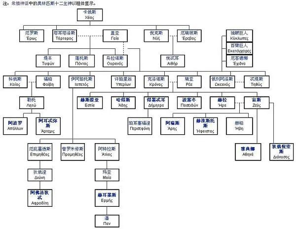
- 泰勒斯 #哲学家 #哲学
	- 公元前7至6世纪的古希腊时期的思想家、科学家、哲学家，希腊最早的哲学学派——米利都学派（也称爱奥尼亚学派）的创始人。希腊七贤之首，西方思想史上第一个有记载有名字留下来的思想家，被称为“科学和哲学之祖”。
	- 公元前5世纪时期，米底王国和迦勒底人联合攻占了亚述首都尼尼微，亚述的领土被两国瓜分了。米底继续向西扩张，和吕底亚王国在哈吕斯河一带展开了一场长达五年的战争，平民百姓流离失所。这时候，有一位智者，扬言上天反对人世战争，某日必以日食为警告，当时没有人相信他。公元前585年5月28日，当两国将士短兵相接时，天突然黑了下来，白昼顿时变成了黑夜，交战的双方惊恐万分，于是马上停战和好，后来两国还互通婚姻。而这位人类史上首次预言日食的智者，就是后来被世人追为西方哲学史第一位哲学家——泰勒斯。
- 古希腊七贤 #哲学 #人物
	- 古希腊七贤，古代希腊七位名人的统称，现代人了解较多的只有立法者梭伦和哲学家泰勒斯两人，剩余五人一般认为是契罗、毕阿斯、庇塔库斯、佩里安德、克莱俄布卢，但无法确定。
	- 雅典的梭伦（Solon of Athens），他的格言相传是“避免极端”（Nothing in excess）。
	  斯巴达的契罗（Chilon of Sparta），他的格言相传是“莫妄想不可能之事”（Do not desire the impossible）或“认识你自己”（first Know yourself）。
	  米利都的泰勒斯（Thales of Miletus），他的格言相传是“只在乎稳定会带来毁灭”（To bring surety brings ruin）或“认识你自己”（Know thyself）。
	  普里耶涅的毕阿斯（Bias of Priene），他的格言相传有“人多反而坏事”（Too many workers spoil the work）、“多数人皆恶人”（Most men are bad）。
	  林度斯的克莱俄布卢（英语：Cleobulus）（Cleobulus of Lindos），他的格言相传是“适度即至善”（Moderation is the chief good）。
	  米蒂利尼的庇塔库斯（Pittacus of Mitylene），他的格言相传是“认清你的时机”（Know thine opportunity）。
	  科林斯的佩里安德（Periander of Corinth），他的格言相传是“事事都应做长远考虑”（Forethought in all things）。
	- 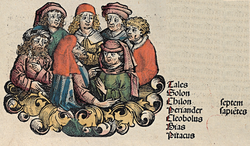
- 哲学 #哲学
	- 
	- 古希腊罗马哲学包括自然哲学、形而上学和伦理哲学三个阶段，为西方哲学的理性思辨和形而上学打下了传统根基。它提出了逻辑、存在、实体等成为西方哲学的经典命题，而柏拉图和亚里士多德关于共相性质的争论开启了中世纪基督教哲学关于唯名论和实在论的争论。
	- 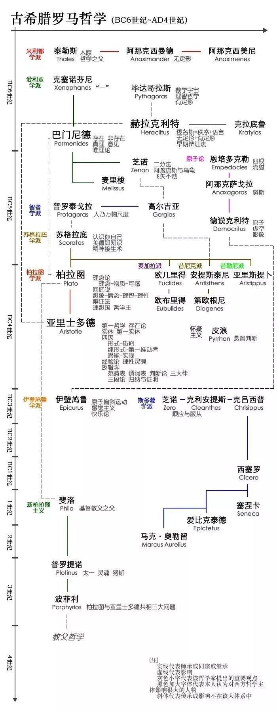
	- 西罗马帝国崩溃后，基督教成为西欧不可侵犯的绝对的意识形态，哲学成为“神学的婢女”，被基督教信仰的浓重阴影所笼罩。从教父哲学（柏拉图-奥古斯丁体系）到经院哲学（亚里士多德-阿奎那体系）的过渡，反应了希腊罗马理性精神的复苏，而唯名论和实在论的对立为近代理性主义和经验论的兴起开辟了道路。
	- 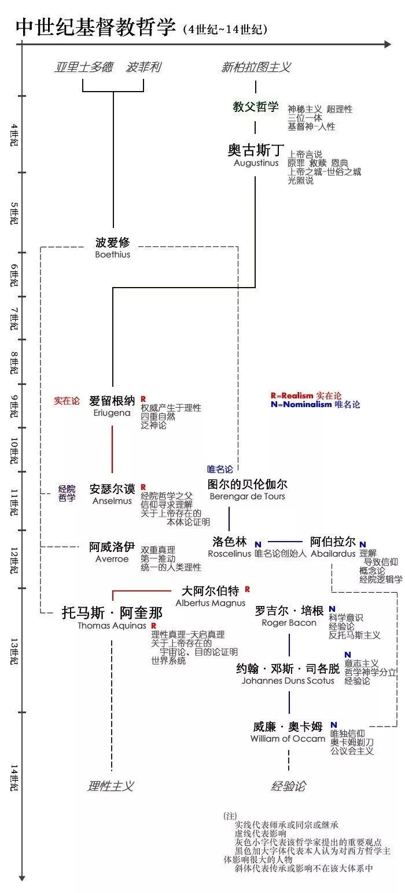{:height 1106, :width 499}
	- 近代早期西欧哲学从文艺复兴和宗教改革运动开始，演化出欧陆唯理论同不列颠经验论的对立，其核心是理性反思和对经验（外在或内在）的重视。唯理论演变成莱布尼茨-沃尔夫体系中的独断论，而经验论则在休谟那里成为彻底的怀疑主义，这为法兰西启蒙思想和德意志古典哲学的出现埋下了伏笔。
	- 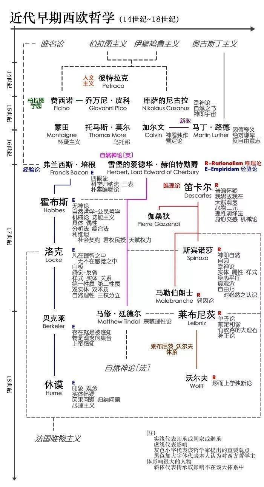
	- 18世纪法国哲学包括法国自然神论和唯物主义两块，探讨的核心问题是人与自然的关系，理论上则表现为思维和存在的关系。法国自然神论奠定了西方政治学的基础，而激进的卢梭则引导了后世批判哲学（马克思和尼采）的出现。法国唯物主义者否定自由意志，但推崇人的理性，使理性主义成为法国哲学鲜明的特点。
	- 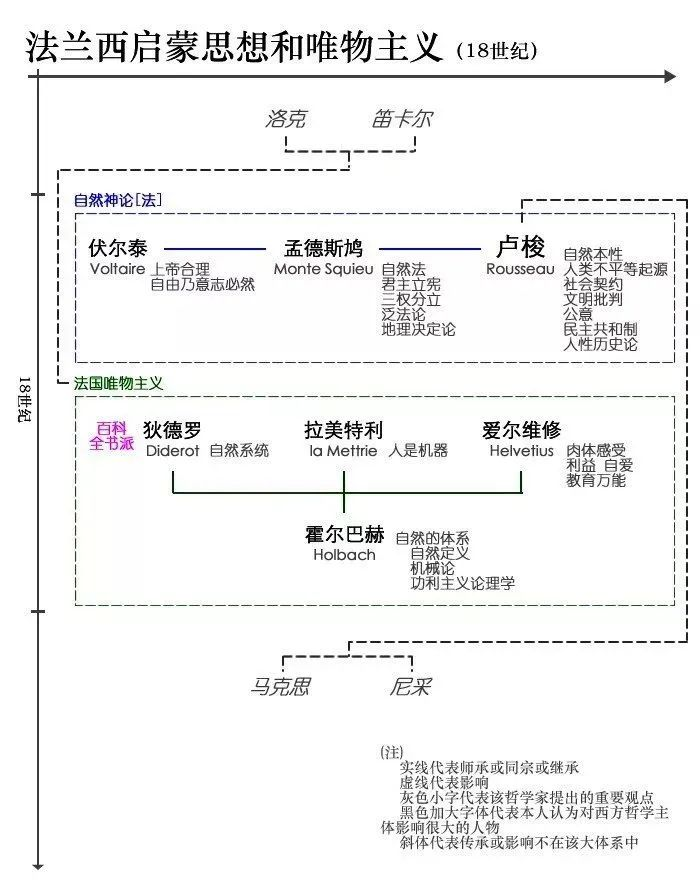
	- 18世纪末19世纪初，德意志古典哲学体系的出现标志着传统西方哲学的最高成就。它将考察重点转向主体与客体的关系，实现了西方哲学继亚里士多德形而上学体系之后的第二次飞跃。康德通过对自在之物和现象的严格区分，发展出认识论的先验自我意识统摄机能和道德实践领域的纯粹理性，以及沟通两者的判断力批判。黑格尔通过辩证法三段论将整个世界容纳在绝对精神从自在状态过渡到自为状态，最终达成绝对理性自我意识的宏大历史过程。因此，黑格尔成为最后一个形而上学大体系，并引发费尔巴哈和马克思对其的反思。
	- 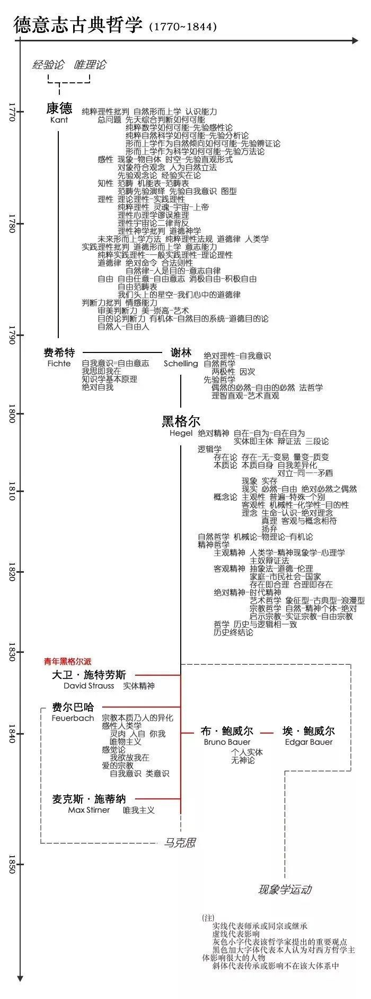
	- 19世纪中后期，形而上学和理性主义的传统西方哲学走向终结，导致了向现代西哲的过渡时期。马克思把哲学从天上拽回了人间，对人的感性活动即实践的确认使得马克思主义成为形而上学的终结者（海德格尔语）；以尼采为代表的非理性主义则着重于人生命意志的实现。两者的思想都没有构成完整的体系，但对后世的现代西哲、现象学运动、结构主义、西马、精神分析学乃至后现代哲学，产生了不可替代的巨大启发。
	-
-