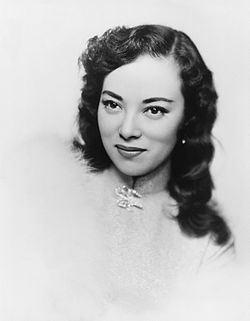

- #名人名言
	- 我心甘情愿的为爱让步出我部分的骄傲，从这以后我的自负被另外一个女孩在在我心理的感情抑制住——波伏瓦
- 普罗米亚 #动画 #电影
- 李香兰 #人物
	- 李香兰（1920年2月12日－2014年9月7日），出生名及山口淑子（日语：山口 淑子／やまぐち よしこ Yamaguchi Yoshiko），第二次结婚后户籍名大鹰淑子（日语：大鷹 淑子／おおたか よしこ Ōtaka Yoshiko），日本人，祖籍日本佐贺县杵岛郡北方村（今佐贺县武雄市北方町（日语：北方町 (佐賀県)）），生于中国奉天省辽阳县北烟台（今辽宁省灯塔市烟台社区）。李香兰是其义父李际春为之取的汉名，沿用为艺名，也是华人熟知的名字，而她在北平市上学时所用的名字潘淑华则由她另一名义父潘毓桂所取。李香兰能操一口流利北京话，又受过正式西洋声乐教育，是抒情女高音，擅长美声唱法，故是当时于中日两国皆极为知名的歌手、电影演员，后担任日本参议院参议员。2014年9月7日，因心脏衰竭在家中去世，享年94岁。
	- 