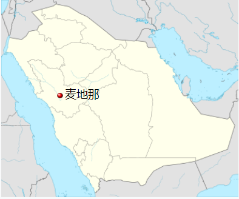
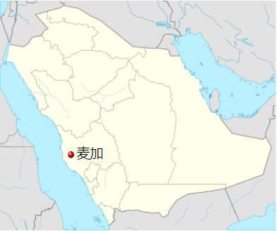
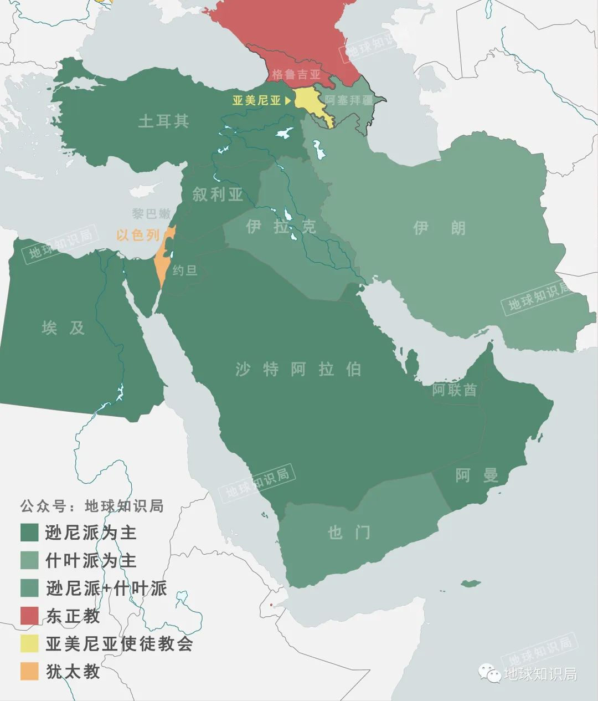

- 啤酒花
	- 在植物学上，啤酒花又叫蛇麻、忽布，是一种多年生、具有攀援属性、雌雄异株的草本植物。从分类上看，蛇麻跟大麻有亲缘关系，区别在于前者不含精神成瘾成分。啤酒花并非蛇麻的花，而是一个类似花苞的植物器官，它的结构中有独特的蛇麻腺体，其中包含了树脂和精油，也就是酿酒师们最看重的啤酒苦味和香气的风味来源。不过这一特性只有不经过授粉的雌性植株才具备，授粉会给啤酒花带来过量的脂肪酸，影响啤酒风味和泡沫稳定性。
- 麦加 麦地 #地理 #宗教
	- 麦地那在伊斯兰传统上被认定为三座最神圣城市中的第二位，其他两座城市分别为麦加及耶路撒冷。
	- 
	- 麦地那（阿拉伯语：ٱلْمَدِيْنَة‎，罗马化：al-Madīnah，直译：城市，汉志阿拉伯语发音：[almaˈdiːna]），正式名称为麦地那穆那瓦拉（阿拉伯语：المدينة المنورة‎，罗马化：al-Madīnah al-Munawwarah，直译：光芒四射的城市，汉志阿拉伯语发音：[almadiːna almʊnawːara]），为沙特阿拉伯麦地那省省会及伊斯兰教第二大圣城。
	- https://zh.wikipedia.org/zh-my/%E9%BA%A6%E5%9C%B0%E9%82%A3
	- 麦加被认为是伊斯兰教先知穆罕默德的发祥地。
	- 麦加（阿拉伯语：مكة‎，罗马化：Makkah，汉志阿拉伯语发音：[makːa]，中文较罕见的翻译有满克、墨克等译名），正式名称为麦加·穆卡拉玛（阿拉伯语：مكة المكرمة‎，罗马化：Makkat al-Mukarramah，直译：荣誉的麦加，汉志阿拉伯语发音：[makːa almʊkarːama]），为伊斯兰教第一大圣城，伊斯兰教的发祥地及沙地阿拉伯麦加省省会[3]。
	- 
	- https://zh.wikipedia.org/zh-my/%E9%BA%A5%E5%8A%A0
	- 
-