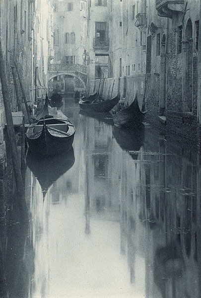

- 猛犸洞国家公园 #奇观
	- 该公园佔地21,380公頃，其主体部分為猛獁洞的一部分，位于埃德蒙森县境内。猛獁洞的正式名稱為猛獁洞-火石嶺洞穴系統，是现在世界上已知的溶洞系统中最大的一个，截至2013年2月15日，已探明洞穴总长度达400英里（約640公里），數目每年仍在不斷上升。
	- 猛獁洞国家公园（英語：Mammoth Cave National Park，又譯猛犸洞国家公园），是美国肯塔基州西南部的一个国家公园，1926年批准通過，1941年建立，1981年10月27日被联合国教科文组织认定为世界遗产，1990年9月26日又被列入世界生物圈保护区名单。
	- https://zh.m.wikipedia.org/zh/%E7%8C%9B%E7%8A%B8%E6%B4%9E%E5%9B%BD%E5%AE%B6%E5%85%AC%E5%9B%AD
	- https://mp.weixin.qq.com/s/Y8fIwbPdC3_S83yuHgLZEQ
- aed automated external defibrillator #医疗 #急救
	- 自动体外除颤器
- 大宫女 #艺术
	- 
	- 大宫女（Grande Odalisque）是法国画家让·奥古斯特·多米尼克·安格尔于1814年创造的一副油画。这幅画是受拿破仑的妹妹，那不勒斯王国王后卡罗琳·波拿巴的委托而做。显示土耳其内宫一裸体宫女。现藏于法国巴黎卢浮宫。
	- 宫女的脊柱被刻意拉长，组成“两个或三个椎体” 甚至“五个椎体”之多，而使骨盆及下背部加长。这可能代表了宫女的感性阴柔美。此外，她的目光和她的骨盆区域之间的距离，可能是该女人的深度思考和复杂情感的一个物理性表现。
- 画意摄影 #艺术 #摄影
	- 画意摄影以其唯美的绘画风格表达人文美与自然美，一直是摄影艺术里一种重要的表现手法。自摄影术发明，可以说，画意摄影一直贯穿其中，并且在摄影发展史上起了几个里程碑的作用。
	  十九世纪后半叶，英国摄影家雷兰德拍摄出了曾被预言为“摄影新时代来临了”的作品-----《人生的两条道路》，在摄影还被轻视的当时，这幅作品以其劝勉性的主题和油画式的构图，受到了维多利亚女王的极高评价。可以这样说，雷兰达对推进摄影被承认为是一门艺术功不可没。从此，画意摄影也逐渐成为摄影艺术中的一个重要流派。
	-  
	- 
	-
- 摄影分离派 #艺术 #团体
	-