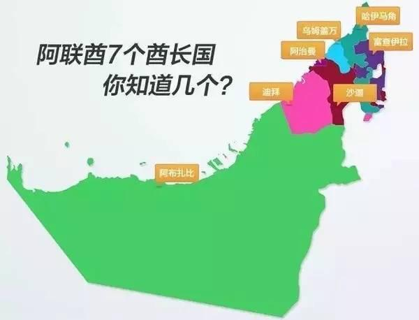

- 伊朗前王后法拉·巴列维（Farah Pahlavi） #人物
	- 沙赫巴努 #名词
		- 理解为皇后，或女王，意思是和国王享有同等身份。这是照搬了西方的君主立宪制，在西方，“皇后”和“女王”都称为“Queen”，而法拉被加冕就等于拥有了“Queen”的身份
	- https://mp.weixin.qq.com/s/mGRBROEGF3Z5t-TJl1rWIw
- 格鲁纳德岛 #岛屿 #地理
	- 格林纳德岛 (/ˈɡ[RɪñĴərd/ 格林-yərd;[6]苏格兰盖尔语: 艾琳·格鲁纳德（Eilean Ghruinneard））是一个小的椭圆形 苏格兰人 岛约2公里（1 1⁄4 英里）长1公里（5⁄8 mi）宽，位于 格林纳德湾 ，大约介于 盖尔洛奇 和 乌拉浦.[7] 最靠近大陆的地方约为1公里（5⁄8 mi）离岸。经过对该岛的实验，该岛对所有哺乳动物都是危险的 炭疽病 细菌在1942年被发现，直到20世纪后期才被净化。
	- https://upwikizh.top/wiki/Gruinard_Island
- 埃米尔 emir #宗教 #政治
	- 埃米尔(Emir)一词源于阿拉伯语，原意为“统帅”、“长官”或 “总督”，是随着早期阿拉伯半岛封建军事制度而形成的，一种政教合一的统治者的称呼。开始的时候，有点类似于咱们中国的“诸侯”或“军阀”，但渐渐的被加持了浓郁的神权色彩后，不但指导政治军事，也开始统领辖区内的思想和意识形态工作。
- 哈里发 #宗教 #政治
	- 高于埃米尔的，是哈里发 (Khalifah)，也来自于阿拉伯语，原意为“先知代治者”、“先知代理人”或“先知继承者”。
	- 这个哈里发和埃米尔一样，也属于世俗政治军事和宗教意识形态两方面的“大统领”，但地位在埃米尔之上，执行力和影响力相当于东方的“皇帝”和西方的“教皇”两者的合体。
	- 埃米尔，就由哈里发任命。
	- 特别是哈里发，神的代言人的意味更加浓郁，宗教上属于说一不二，能解释一切，决定一切的角色。
- 谢赫 #宗教 #政治
	- 哈里发＞埃米尔＞谢赫
	- 哈里发是皇帝+教皇，埃米尔是国王+宗教首领；而这个谢赫，本意是“伊斯兰教教长”、“部落长老”的意思，泛指那些酋长国里面的部族酋长+宗教长老，由埃尔米尔任命。
	- 
	- 阿富汗的那些部落的酋长们，他们是不能像迪拜的穆罕默德酋长那样，自称“谢赫”的。
	- 因为，跟普及到了整个伊斯兰文化圈的哈里发和埃米尔不同，“谢赫”这个称谓，只限于海湾地区，针对的是阿拉伯酋长，或者是有阿拉伯血统的贵族男性（一般偶尔见于东南亚和南亚穆斯林的姓名前缀）。
- 苏丹 #政治 #宗教
	- 早在奥斯曼帝国时代，他们就已经另辟蹊径，建立了自己的那套政教合一体系——“苏丹”制（Sultan），奥斯曼帝国的实际统治者，土耳其苏丹身兼了哈里发的功能政治、军事、文化一把抓，并霸气地宣称，只有奥斯曼帝国的哈里发，才属于穆斯林们最正统的哈里发。
- 蒙马特高地 #地理
	-