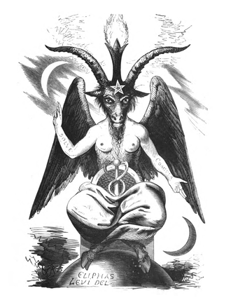

- 卡里斯玛权威 魅力型权威 #名词 #政治
	- 魅力型权威（英语：Charismatic authority）亦称作“感召型权威”、“卡里斯玛型权威”、“魅力型统治”（英语：charismatic domination[1]）、“魅力型领导”（英语：charismatic leadership[2]），为德国知名社会学家马克斯·韦伯在《经济与社会》一书中提出的“三种统治分类”其中一种，其余两种为传统型权威及法理型权威。 他将魅力型权威定义为“对某一个人神圣、英雄或出类拔萃之非凡特质，及其彰显出的行为模式之遵从”。其是建基于领袖“超凡的个人特质、神奇的洞见或成就，并吸引跟随者尽忠和服从”的权力。魅力型权威的权力源自个人超凡的特质，在民众心中被认为是神授的，追随者也因此对他忠诚。
	- 魅力型权威则是：建基于领袖“超凡的个人特质、神奇的洞见或成就，并吸引跟随者尽忠和服从”之权力。
- 传统型权威 #名词 #政治
	- 传统型权威（英语：traditional authority）是指依靠传统（习惯）的“合理性”和神圣性而实现其“统治”的权威，其最常见的权力合法性理由为权力一直都是这样并且一直都存在。传统型权威出自德国社会学家韦伯马克斯·韦伯在《经济与社会》一书中提出的“三种统治分类”之一，其他两种是魅力型权威和法理型权威。在韦伯看来，传统型权威的基础在于相信常规和传统的合理性。
	- 在传统型权威下，统治者权力归因于人民对传统的信仰，统治权力基础来自历史悠久的习俗与传统，重大决策与行动往往依循成规，其正当性来自于遵守传统所延伸的权威。传统型权威源自长久确立的模式，赋与民众或团体合法的社会权力；权力行使来自人民对传统的信仰与遵从，与领导者个人特质无关，皇位与世袭爵位就是典型的例子。
- 法理型权威 #名词 #政治
	- 法理型权威（英语：Rational-legal authority）是以法律为依据进行统治与管理，[1]法理型权威源自规则与管制，典型的是有文字记载的法律、诉讼程序或行为守则。换言之，权力是由法律所赋予，民众的服从是基于现实理性，与领袖的个人特质无关，官僚组织或科层制的领袖属于此一类型。其又称为“理性权威”，“法型权威”，“理性管制”，“法理管制”或“科层权威”，是一种领导的形式。
	- 在这种形式下组织或政权的权威很大程度与法制上的理性、合法性和科层制度连系。根据这种分类的方法，二十世纪大多数的现代国家，皆以法理型权威的形态实行统治。
- 叫魂：1768年中国妖术大恐慌 #书
	- 《叫魂：1768年中国妖术大恐慌》是美国汉学家孔飞力1990年出版的一本学术著作，作者通过对1768年中国一起妖术事件的研究，揭示了当时国家的运行机制。
	- 1768年春，中国浙江德清出现了“叫魂”案件，据传施法者可以通过被害人的姓名、衣物等对其做法，斩断他们的辫子，继而吸取其灵魂精气。流言迅速传播，并引起各地百姓的恐慌，民间出现自发的对妖术的惩罚行为。妖术谣言6月传播至长江上游，初秋传播到华北，10月份传播至陕西境内。时任统治者乾隆皇帝下令在全国境内严查妖术，经过3个月调查，军机处认定妖术事件为谣言。
	- 孔飞力认为，乾隆盛世表面上经济繁荣，实则危机重重，人口过度增长，人均资源恶化，妖术事件实为平民阶层的一种权力补偿。
- 巴风特 #宗教 #神话
	- 巴风特（英语：Baphomet，或译巴弗灭）是有名的基督宗教恶魔之一，是现今为人所熟知的羊头恶魔，也是撒旦的代名词。这个名字的起源尚无定论，它最早出现于12世纪晚期一首与穆罕默德有关的普罗旺斯语诗篇中，在14世纪初又作为异教偶像的称呼出现在异端裁判所对圣殿骑士（圣堂武士）的审讯笔录中。然而到了19世纪，这一名称随着一系列伪历史作品的出版又进入了以英语为母语的人们的视线，这些作品试图将圣殿骑士与一系列阴谋论联系起来。“巴风特”从此开始与法国神秘学家艾利冯斯·李维所画的“安息日之羊”有关。
	- 
	- https://zhcn.eferrit.com/eliphas-levi%E7%9A%84baphomet%EF%BC%9A%E9%97%A8%E5%BE%B7%E6%96%AF%E7%9A%84%E5%B1%B1%E7%BE%8A/
-