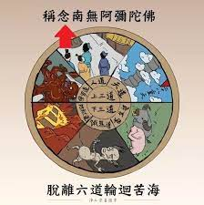

- 波波尔·乌 #神话 #书
	- 此书一开始为马雅文明的创世神话，紧接着是马雅双胞胎英雄乌纳普及斯巴兰克这两位在马雅神话中极重要角色的故事。《波波尔·乌》之后又围绕在王族以及欲以神力维持统治的众神身上，详细描述了基切人的历史与建国基础。
	- https://zh.wikipedia.org/wiki/%E6%B3%A2%E6%B3%A2%E7%88%BE%C2%B7%E7%83%8F
- 自我 #心理
	- 自我有两个成分，主观的我和客观的我
	- 主观的我是自我概念的最基础的部分，主管的我感觉到自己与他人是分离的，不同的，并能够认识到行为的主体是“我”。
		- 主管的我有三个基本特征：感受到我与他人是不同的，我作为一个独特个体是拥有独特的体验的，这一特性被称为差异性
		- 感受到我是一个能给他人带来影响的能动者的这一特性被称为能动性
		- 感受到每时每刻的自己都是恒定的
	- 客观的我，即一个人能够描述的自我，个性特质，社会角色社会关系，思维和感情等方面
- 逃避主义 #心理
	- 人的精神习惯性的逃离现实与日常并投入到纯粹的想象或者娱乐中
	- 人们将幻想和娱乐作为自己精神的避风港，而非工作等事物
	- 被异化的人们会有无力感，无意义感，无规范感和自我疏远感
- 六道 #宗教
	- 是指“三恶道”：地狱道、饿鬼道、畜生道；和“三善道”：人道、阿修罗道、天道。
	- 
	-