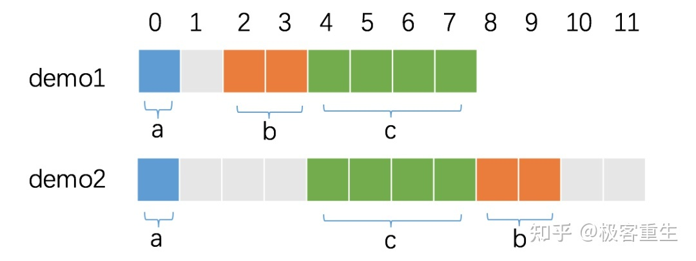

- 优先使用 strconv 而不是 fmt
基本数据类型与字符串之间的转换，优先使用 strconv 而不是 fmt，因为前者性能更佳。

- 从性能出发，兼顾易用可读，如果待拼接的变量不涉及类型转换且数量较少（<=5），行内拼接字符串推荐使用运算符 +，反之使用 fmt.Sprintf()。

- 非行内拼接字符串推荐使用 strings.Builder

- 在 Go 中，我们可以使用 unsafe.Sizeof 计算出一个数据类型实例需要占用的字节数。

- func worker(ch chan struct{}) {
    <-ch
    fmt.Println("do something")
}
func main() {
    ch := make(chan struct{})
    go worker(ch)
    ch <- struct{}{}
    close(ch)
}
有时候使用 channel 不需要发送任何的数据，只用来通知子协程（goroutine）执行任务，或只用来控制协程的并发。这种情况下，使用空结构体作为占位符就非常合适了。

- 仅包含方法的结构体
	 - 
```
type Door struct{}
- func (d Door) Open() {
	fmt.Println("Open the door")
}
- func (d Door) Close() {
	fmt.Println("Close the door")
}

```

- 合理的 struct 布局
	 - 
```golong
type demo1 struct {
  a int8
  b int16
  c int32
}

type demo2 struct {
  a int8
  c int32
  b int16
}

func main() {
  fmt.Println(unsafe.Sizeof(demo1{})) // 8
  fmt.Println(unsafe.Sizeof(demo2{})) // 12
}

```

	 - 

- sync.Pool 复用对象
	 - sync.Pool 是 sync 包下的一个组件，可以作为保存临时取还对象的一个“池子”。个人觉得它的名字有一定的误导性，因为 Pool 里装的对象可以被无通知地被回收，可能 sync.Cache 是一个更合适的名字。

	 - sync.Pool 是可伸缩的，同时也是并发安全的，其容量仅受限于内存的大小。存放在池中的对象如果不活跃了会被自动清理。

- sync.Cond
	 - broadcast，一个write以后3个read再一起读

- 

- golang 编译，减少编译体积
	 - go build -ldflags="-s -w" -o server main.go

	 - -s：忽略符号表和调试信息。
-w：忽略DWARFv3调试信息，使用该选项后将无法使用gdb进行调试。

	 - go build -ldflags="-s -w" -o server main.go && upx -9 server

	 - upx 压缩，1 代表最低压缩率，9 代表最高压缩率。

	 - upx 压缩后的程序和压缩前的程序一样，无需解压仍然能够正常地运行，这种压缩方法称之为带壳压缩，压缩包含两个部分：

	 - 在程序开头或其他合适的地方插入解压代码；
将程序的其他部分压缩。
执行时，也包含两个部分：

	 - 首先执行的是程序开头的插入的解压代码，将原来的程序在内存中解压出来；
再执行解压后的程序。

- 
